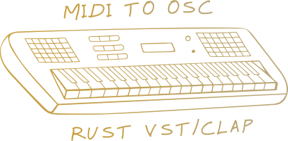

# What

This VST/CLAP plugin intercepts MIDI events and
sends them over the network using the OSC protocol.

While fully functional, it is meant to be used as a template :
- not all MIDI events are intercepted
- OSC server address is hardcoded
- binaries are not published, see `How to use in a DAW`

# Why 

Some DAWs (Digital Audio Workstation) do not have features
to enable intercepting MIDI events and broadcasting
them using a network protocol.

For these DAWs, a VST or a CLAP plugin must be developed.

Historically, this is done using C/C++.

Thanks to Rust packages `nih-plug`, `vst3-sys` and `clap-sys`, developing
VST and CLAP plugins can be conveniently done using Rust.

# How to use in a DAW

This plugin is not published in binary form and needs to be compiled
using the command 

`cargo run bundle rust-vst-midi2osc --release`

Which outputs paths to the plugins :

```
Created a CLAP bundle at 'target/bundled/rust-vst-midi2osc.clap'
Created a VST3 bundle at 'target/bundled/rust-vst-midi2osc.vst3'
```


